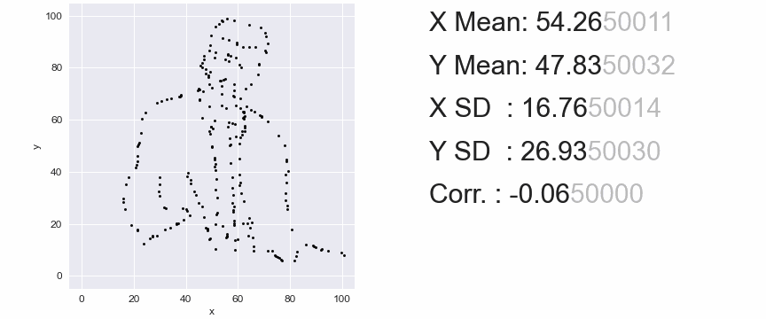
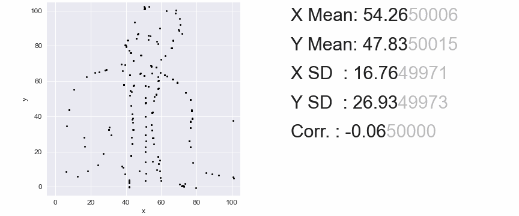
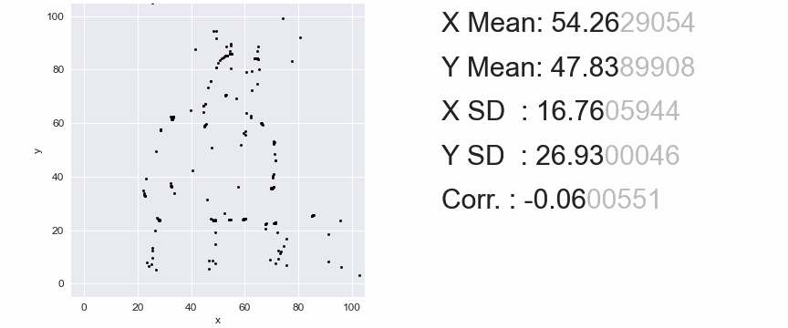
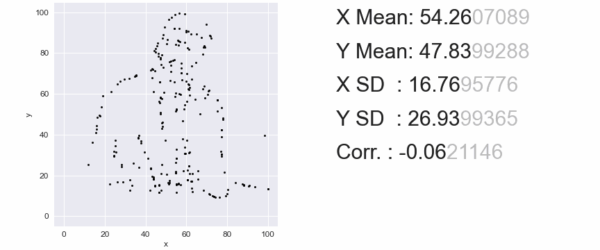

# Same Stats, Different Graphs: An Instant Transformation Method

# Environment instructions

Python version 3.10.4

Install packages with: 'pip install -r requirements.txt'. 

## Recreating target shapes as a scatter plot

To recreate the experiments performed in the paper:
1. Select the method for recreating target shapes:
- **project_implem.py**: the mathematical approach to acquire a specified covariance matrix, a non-iterative fast approach with good results.
- **datasaurus_dozen_implem.py**: the Datasaurus Dozen Simulated Annealing approach, slow and iterative.
- **datadance_doubledozen_implem.py**: the more precise Simulated Annealing approach, from the DataDance DoubleDozen. Slow and iterative but more exact in shape replication.
- **sgd_implem.py**: a fast gradient descent approach, fast and iterative and uses the mathematical approach from **project_implem.py** to acquire the target covariance matrix.
2. In the chosen script, adjust the variables in the main function to the target shape that you want to replicate and the target summary statistics. You can also adjust the starting shape for all scripts (except for **project_implem.py**). Do note that the starting shape has a fixed set of summary statistics. One can use the function **create_random_cloud** in **project_implem.py** to create a random cloud of 142 points with specified summary statistics.

## DataDance DoubleDozen videos

# Proposed Linear Transformation method results:
 

# SGD results:

# Datasaurus Dozen method results:

# DataDance DoubleDozen method results:
